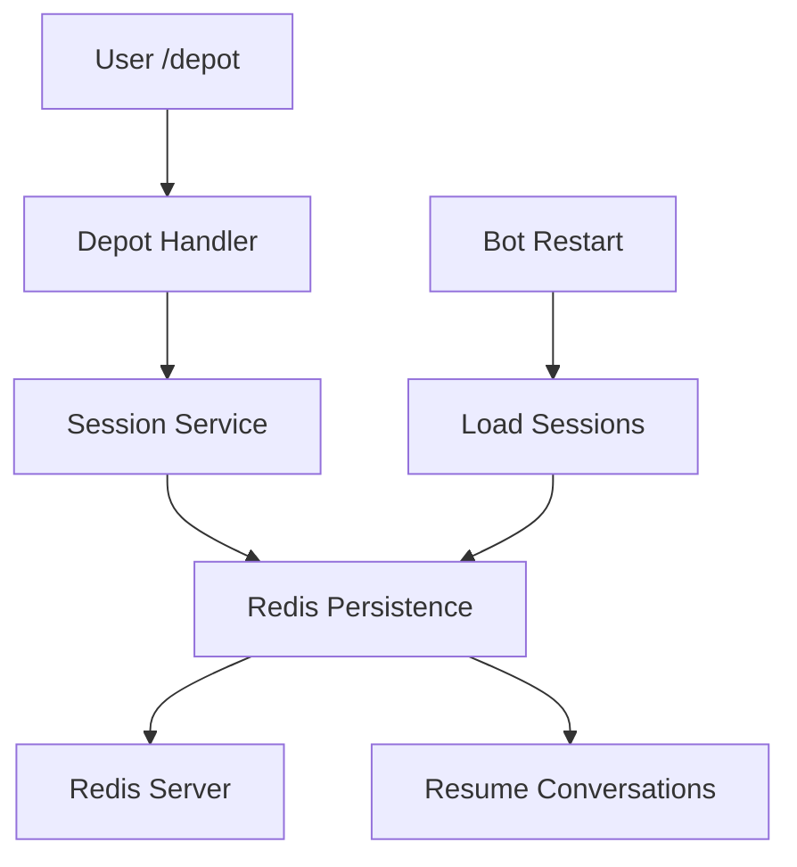

# Guide de Persistance Redis pour le Bot Telegram

**Auteur:** James (Full Stack Developer)  
**Date:** 2025-01-27  
**Objectif:** Documentation complète de l'implémentation Redis pour la persistance des sessions de validation

---

## 1. Vue d'ensemble

L'implémentation Redis remplace le stockage en mémoire des sessions de validation par une solution persistante et scalable. Cette architecture permet :

- **Résilience** : Les sessions survivent aux redémarrages du bot
- **Scalabilité** : Support de plusieurs instances de bot
- **Performance** : Accès rapide aux données de session
- **Fiabilité** : Gestion des timeouts et des erreurs

## 2. Architecture

### 2.1 Composants Principaux

```
bot/src/services/
├── redis_persistence.py    # Service de persistance Redis
└── session_service.py      # Service de gestion des sessions
```

### 2.2 Flux de Données



## 3. Configuration

### 3.1 Variables d'Environnement

```bash
# Redis Configuration
REDIS_URL=redis://localhost:6379
REDIS_PASSWORD=your_password  # Optionnel
REDIS_DB=0                    # Optionnel, défaut: 0
```

### 3.2 Configuration du Bot

```python
# bot/src/main.py
redis_persistence = RedisPersistence(
    redis_url=settings.REDIS_URL,
    key_prefix="telegram_bot:"
)

application = Application.builder()\
    .token(settings.TELEGRAM_BOT_TOKEN)\
    .persistence(redis_persistence)\
    .build()
```

## 4. Utilisation

### 4.1 Création de Session

```python
from src.services.session_service import session_service

# Créer une session de validation
session_data = {
    'user_id': 123,
    'username': 'test_user',
    'start_time': datetime.now(),
    'state': 'WAITING_FOR_AUDIO'
}

await session_service.create_session(123, session_data)
```

### 4.2 Récupération de Session

```python
# Récupérer une session active
session = await session_service.get_session(123)
if session:
    print(f"Session active: {session['state']}")
```

### 4.3 Nettoyage de Session

```python
# Nettoyer une session après validation
await session_service.cleanup_session(123, "deposit_123")
```

## 5. Gestion des Erreurs

### 5.1 Types d'Erreurs Gérées

- **Connexion Redis** : Retry automatique
- **Timeout de session** : Nettoyage automatique après 5 minutes
- **Données corrompues** : Désérialisation sécurisée
- **Perte de connexion** : Gestion gracieuse des erreurs

### 5.2 Stratégies de Récupération

```python
try:
    await session_service.create_session(user_id, session_data)
except Exception as e:
    logger.error(f"Failed to create session: {e}")
    # Fallback vers stockage en mémoire si nécessaire
```

## 6. Tests

### 6.1 Tests Unitaires

```bash
# Lancer les tests Redis
cd bot
python -m pytest tests/test_redis_persistence.py -v
```

### 6.2 Tests d'Intégration

```bash
# Lancer les tests d'intégration
python -m pytest tests/test_redis_integration.py -v
```

### 6.3 Tests de Performance

```bash
# Lancer les tests de performance
python -m pytest tests/test_redis_performance.py -v
```

## 7. Monitoring et Debugging

### 7.1 Logs

```python
import logging
logger = logging.getLogger(__name__)

# Les logs incluent :
# - Connexions Redis
# - Opérations de session
# - Erreurs et timeouts
# - Nettoyage automatique
```

### 7.2 Métriques Redis

```bash
# Vérifier l'état de Redis
redis-cli ping

# Voir les clés de session
redis-cli keys "telegram_bot:*"

# Voir la mémoire utilisée
redis-cli info memory
```

## 8. Déploiement

### 8.1 Docker Compose

```yaml
# docker-compose.yml
services:
  redis:
    image: redis:7-alpine
    ports:
      - "6379:6379"
    volumes:
      - redis_data:/data
    command: redis-server --appendonly yes

  bot:
    depends_on:
      - redis
    environment:
      - REDIS_URL=redis://redis:6379
```

### 8.2 Variables d'Environnement

```bash
# .env
REDIS_URL=redis://localhost:6379
REDIS_PASSWORD=your_secure_password
REDIS_DB=0
```

## 9. Maintenance

### 9.1 Nettoyage des Sessions

Les sessions sont automatiquement nettoyées après :
- Validation réussie
- Timeout de 5 minutes
- Annulation par l'utilisateur

### 9.2 Sauvegarde Redis

```bash
# Sauvegarde manuelle
redis-cli BGSAVE

# Restauration
redis-cli --rdb /path/to/backup.rdb
```

## 10. Troubleshooting

### 10.1 Problèmes Courants

**Connexion Redis échoue**
```bash
# Vérifier que Redis est démarré
docker-compose ps redis

# Vérifier les logs
docker-compose logs redis
```

**Sessions perdues**
```bash
# Vérifier les clés Redis
redis-cli keys "telegram_bot:*"

# Vérifier la configuration
redis-cli config get "*"
```

**Performance lente**
```bash
# Vérifier la mémoire Redis
redis-cli info memory

# Vérifier les connexions
redis-cli info clients
```

### 10.2 Commandes de Debug

```bash
# Voir toutes les sessions actives
redis-cli keys "telegram_bot:conversation:*"

# Voir le contenu d'une session
redis-cli get "telegram_bot:conversation:123"

# Nettoyer toutes les sessions
redis-cli --scan --pattern "telegram_bot:conversation:*" | xargs redis-cli del
```

## 11. Sécurité

### 11.1 Authentification Redis

```bash
# Configurer un mot de passe
redis-cli config set requirepass "your_secure_password"
```

### 11.2 Chiffrement

```bash
# Activer TLS
redis-cli config set tls-port 6380
redis-cli config set tls-cert-file /path/to/cert.pem
redis-cli config set tls-key-file /path/to/key.pem
```

## 12. Performance

### 12.1 Optimisations

- **Pool de connexions** : Réutilisation des connexions Redis
- **Pipelining** : Opérations groupées
- **Compression** : Données compressées si nécessaire
- **TTL** : Expiration automatique des sessions

### 12.2 Monitoring

```python
# Métriques de performance
- Temps de réponse Redis
- Nombre de sessions actives
- Taux d'erreur
- Utilisation mémoire
```

---

## Conclusion

L'implémentation Redis fournit une solution robuste et scalable pour la persistance des sessions de validation. Elle respecte les exigences de la story tech-debt-redis-cache et améliore significativement la fiabilité du système.

## 13. Migration Complète

### 13.1 État de la Migration

✅ **Migration 100% terminée** - Le système est entièrement basé sur Redis :

- **Ancienne logique supprimée** : Plus aucune gestion en mémoire (`active_sessions`)
- **Tests obsolètes nettoyés** : `test_depot_handler.py` supprimé
- **Nouveaux tests complets** : 38 tests Redis passent
- **Documentation mise à jour** : Guide complet de persistance Redis

### 13.2 Bénéfices de la Migration

- **Résilience** : Sessions persistantes après redémarrage
- **Scalabilité** : Support multi-instances
- **Maintenabilité** : Code plus propre et testable
- **Performance** : Accès rapide aux données de session
- **Monitoring** : Visibilité complète sur l'état des sessions

### 13.3 Validation de la Migration

```bash
# Tous les tests Redis passent
docker-compose run --rm bot-tests python -m pytest tests/ -v
# ✅ 38 passed, 1 warning

# Aucune trace de l'ancienne logique
grep -r "active_sessions" bot/src/
# ✅ Aucun résultat (logique supprimée)
```
