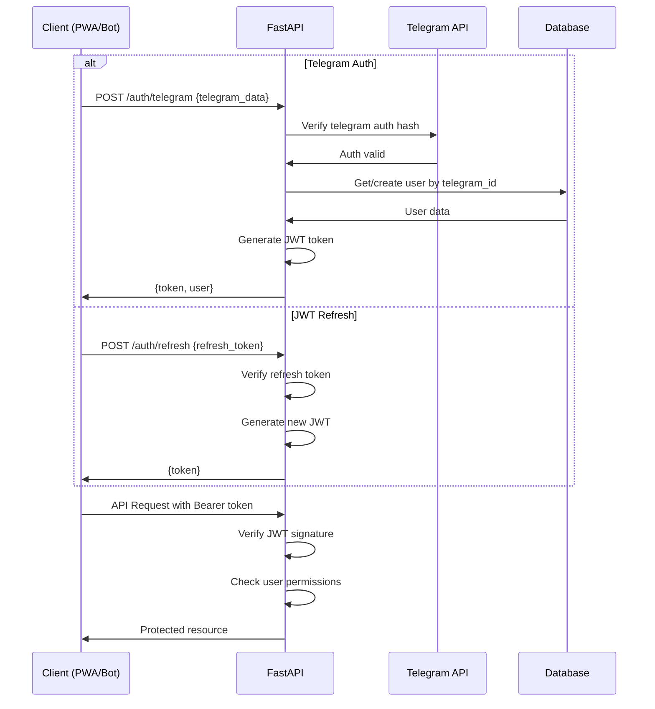

# Backend Architecture

## Service Architecture

### Controller/Route Organization

```
src/
├── api/                    # API routes
│   ├── v1/
│   │   ├── auth.py        # Authentication endpoints
│   │   ├── deposits.py    # Deposits CRUD + classify
│   │   ├── sales.py       # Sales CRUD
│   │   ├── cash.py        # Cash sessions
│   │   ├── users.py       # User management
│   │   └── exports.py     # Ecologic exports
│   └── deps.py            # Dependencies (auth, db)
├── services/              # Business logic
│   ├── ai_service.py      # LangChain + Gemini
│   ├── telegram_service.py# Bot logic
│   ├── sync_service.py    # Cloud sync
│   └── export_service.py  # CSV generation
├── models/                # SQLAlchemy models
│   ├── __init__.py
│   ├── user.py
│   ├── deposit.py
│   ├── sale.py
│   └── cash_session.py
├── schemas/               # Pydantic schemas
│   ├── __init__.py
│   ├── user.py
│   ├── deposit.py
│   └── sale.py
├── core/                  # Configuration
│   ├── config.py         # Settings
│   ├── database.py       # DB connection
│   ├── security.py       # JWT, auth
│   └── exceptions.py     # Custom exceptions
├── utils/                 # Utilities
│   ├── audio.py          # Audio processing
│   ├── validation.py     # Business validation
│   └── formatting.py     # Data formatting
└── main.py               # FastAPI app
```

### Controller Template

```typescript
from fastapi import APIRouter, Depends, HTTPException, status
from sqlalchemy.ext.asyncio import AsyncSession

from ..core.database import get_db
from ..core.security import get_current_user
from ..models.user import User
from ..schemas.sale import SaleCreate, Sale, SaleUpdate
from ..services.cash_service import CashService

router = APIRouter(prefix="/sales", tags=["sales"])

@router.post("/", response_model=Sale)
async def create_sale(
    sale_data: SaleCreate,
    current_user: User = Depends(get_current_user),
    db: AsyncSession = Depends(get_db),
):
    """Créer une nouvelle vente"""
    try:
        cash_service = CashService(db)
        sale = await cash_service.create_sale(
            sale_data=sale_data,
            cashier_id=current_user.id
        )
        return sale
    except ValueError as e:
        raise HTTPException(
            status_code=status.HTTP_400_BAD_REQUEST,
            detail=str(e)
        )

@router.get("/", response_model=list[Sale])
async def list_sales(
    site_id: str,
    skip: int = 0,
    limit: int = 100,
    current_user: User = Depends(get_current_user),
    db: AsyncSession = Depends(get_db),
):
    """Liste des ventes avec pagination"""
    cash_service = CashService(db)
    sales = await cash_service.get_sales(
        site_id=site_id,
        skip=skip,
        limit=limit
    )
    return sales
```

## Database Architecture

### Schema Design

Voir section "Database Schema" pour le SQL complet.

### Data Access Layer

```typescript
from typing import Generic, TypeVar, Type, Optional, List
from sqlalchemy.ext.asyncio import AsyncSession
from sqlalchemy import select, update, delete
from sqlalchemy.orm import selectinload

T = TypeVar('T')

class BaseRepository(Generic[T]):
    def __init__(self, db: AsyncSession, model: Type[T]):
        self.db = db
        self.model = model
    
    async def get_by_id(self, id: str) -> Optional[T]:
        result = await self.db.execute(
            select(self.model).where(self.model.id == id)
        )
        return result.scalar_one_or_none()
    
    async def get_multi(
        self, 
        skip: int = 0, 
        limit: int = 100,
        **filters
    ) -> List[T]:
        query = select(self.model)
        
        # Apply filters
        for key, value in filters.items():
            if hasattr(self.model, key):
                query = query.where(getattr(self.model, key) == value)
        
        query = query.offset(skip).limit(limit)
        result = await self.db.execute(query)
        return result.scalars().all()
    
    async def create(self, obj_data: dict) -> T:
        obj = self.model(**obj_data)
        self.db.add(obj)
        await self.db.commit()
        await self.db.refresh(obj)
        return obj
    
    async def update(self, id: str, obj_data: dict) -> Optional[T]:
        await self.db.execute(
            update(self.model)
            .where(self.model.id == id)
            .values(**obj_data)
        )
        await self.db.commit()
        return await self.get_by_id(id)
    
    async def delete(self, id: str) -> bool:
        result = await self.db.execute(
            delete(self.model).where(self.model.id == id)
        )
        await self.db.commit()
        return result.rowcount > 0

# Exemple d'usage
class SaleRepository(BaseRepository[Sale]):
    def __init__(self, db: AsyncSession):
        super().__init__(db, Sale)
    
    async def get_by_session(self, session_id: str) -> List[Sale]:
        result = await self.db.execute(
            select(Sale)
            .where(Sale.session_id == session_id)
            .options(selectinload(Sale.cashier))
        )
        return result.scalars().all()
    
    async def get_daily_total(self, site_id: str, date: date) -> float:
        result = await self.db.execute(
            select(func.sum(Sale.total_amount))
            .where(
                Sale.site_id == site_id,
                func.date(Sale.created_at) == date
            )
        )
        return result.scalar() or 0.0
```

## Authentication and Authorization

### Auth Flow



### Middleware/Guards

```typescript
from fastapi import HTTPException, status, Depends
from fastapi.security import HTTPBearer
from jose import JWTError, jwt
from sqlalchemy.ext.asyncio import AsyncSession

from ..core.config import settings
from ..core.database import get_db
from ..models.user import User

security = HTTPBearer()

async def get_current_user(
    token: str = Depends(security),
    db: AsyncSession = Depends(get_db)
) -> User:
    credentials_exception = HTTPException(
        status_code=status.HTTP_401_UNAUTHORIZED,
        detail="Could not validate credentials",
        headers={"WWW-Authenticate": "Bearer"},
    )
    
    try:
        payload = jwt.decode(
            token.credentials, 
            settings.SECRET_KEY, 
            algorithms=[settings.ALGORITHM]
        )
        user_id: str = payload.get("sub")
        if user_id is None:
            raise credentials_exception
    except JWTError:
        raise credentials_exception
    
    user = await db.get(User, user_id)
    if user is None or not user.is_active:
        raise credentials_exception
    
    return user

def require_role(required_role: str):
    def role_checker(current_user: User = Depends(get_current_user)) -> User:
        if current_user.role != required_role:
            raise HTTPException(
                status_code=status.HTTP_403_FORBIDDEN,
                detail="Insufficient permissions"
            )
        return current_user
    return role_checker

# Usage
@router.post("/admin/users", dependencies=[Depends(require_role("admin"))])
async def create_user(...):
    pass
```

---
