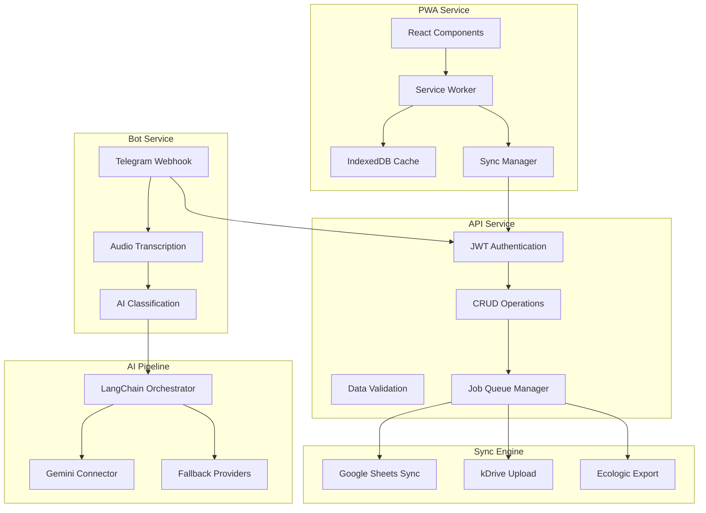

# Components

## Bot Telegram Service

**Responsibility:** Gestion des interactions Telegram avec transcription audio et classification IA

**Key Interfaces:**
- POST /webhook/telegram - Réception messages Telegram
- WebSocket /ai/classify - Classification temps réel

**Dependencies:** FastAPI Backend, Gemini API, Redis Queue

**Technology Stack:** Python + python-telegram-bot + LangChain + asyncio

## FastAPI Backend

**Responsibility:** API REST centrale, orchestration services, persistence données

**Key Interfaces:**
- REST API OpenAPI 3.0 complète
- WebSocket pour notifications temps réel
- Queue Redis pour jobs asynchrones

**Dependencies:** PostgreSQL, Redis, Services externes

**Technology Stack:** FastAPI + SQLAlchemy + Alembic + Pydantic + asyncpg

## PWA Frontend

**Responsibility:** Interface caisse responsive avec mode offline et synchronisation

**Key Interfaces:**
- Interface caisse 3 modes (Catégorie/Quantité/Prix)
- Dashboard admin avec monitoring
- PWA offline avec Service Worker

**Dependencies:** FastAPI Backend, IndexedDB (offline), Notification API

**Technology Stack:** React + Vite + Mantine + Zustand + Workbox

## AI Classification Pipeline

**Responsibility:** Pipeline LangChain pour transcription audio et classification EEE

**Key Interfaces:**
- async classify_audio(audio_file) -> EEEClassification
- async transcribe_audio(audio_file) -> string

**Dependencies:** Gemini API, fallback providers (OpenAI, Groq)

**Technology Stack:** LangChain + Gemini + asyncio + retry logic

## Sync Engine

**Responsibility:** Synchronisation cloud automatique (Google Sheets, Infomaniak, exports)

**Key Interfaces:**
- async sync_google_sheets(site_id)
- async export_ecologic_csv(period)
- async upload_infomaniak(files)

**Dependencies:** Google Sheets API, Infomaniak WebDAV, Redis Queue

**Technology Stack:** Python + aiohttp + openpyxl + asyncio + cron jobs

## Component Diagrams

---
