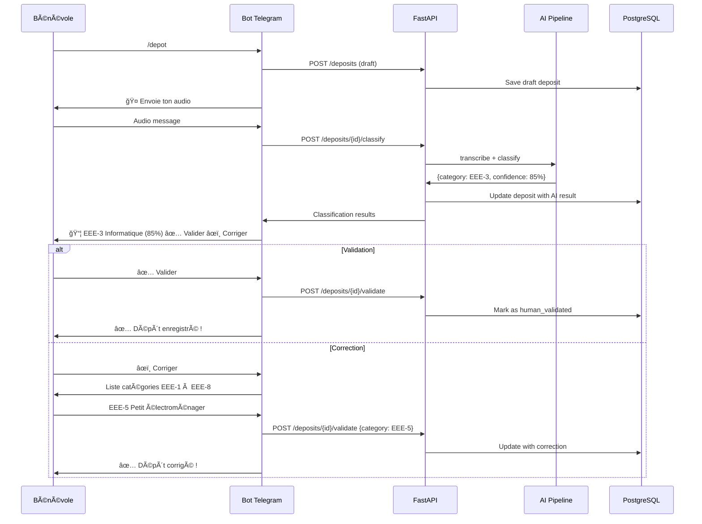
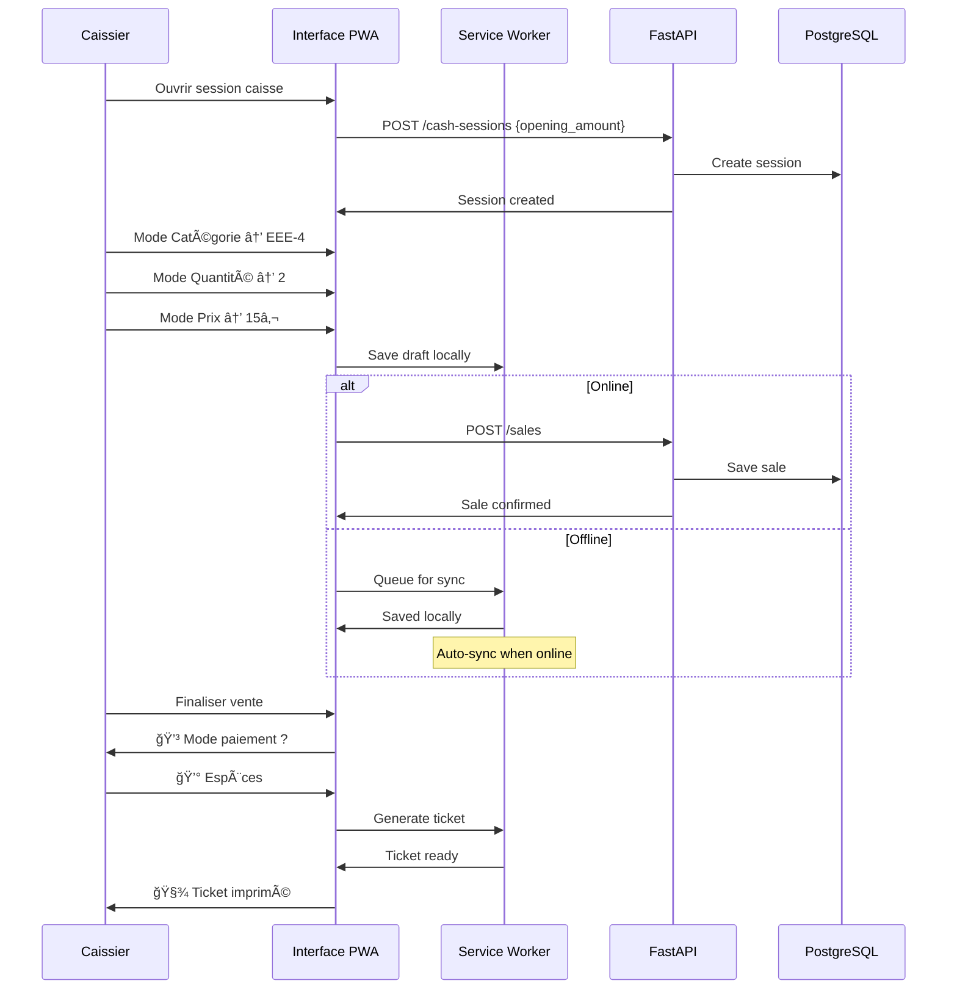
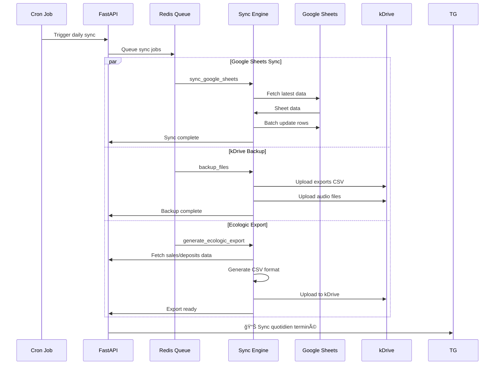

# Core Workflows

## Workflow Classification Dépôt via Bot

```mermaid
sequenceDiagram
    participant U as Bénévole
    participant TG as Bot Telegram
    participant API as FastAPI
    participant AI as AI Pipeline
    participant DB as PostgreSQL
    
    U->>TG: /depot
    TG->>API: POST /deposits (draft)
    API->>DB: Save draft deposit
    TG->>U: 🤠Envoie ton audio
    
    U->>TG: Audio message
    TG->>API: POST /deposits/{id}/classify
    API->>AI: transcribe + classify
    AI->>API: {category: EEE-3, confidence: 85%}
    API->>DB: Update deposit with AI result
    
    API->>TG: Classification results
    TG->>U: 📦 EEE-3 Informatique (85%) ✅ Valider âœï¸ Corriger
    
    alt Validation
        U->>TG: ✅ Valider
        TG->>API: POST /deposits/{id}/validate
        API->>DB: Mark as human_validated
        TG->>U: ✅ Dépôt enregistré !
    else Correction
        U->>TG: âœï¸ Corriger
        TG->>U: Liste catégories EEE-1 à EEE-8
        U->>TG: EEE-5 Petit électroménager
        TG->>API: POST /deposits/{id}/validate {category: EEE-5}
        API->>DB: Update with correction
        TG->>U: ✅ Dépôt corrigé !
    end
```

## Workflow Vente Interface Caisse

```mermaid
sequenceDiagram
    participant C as Caissier
    participant PWA as Interface PWA
    participant SW as Service Worker
    participant API as FastAPI
    participant DB as PostgreSQL
    
    C->>PWA: Ouvrir session caisse
    PWA->>API: POST /cash-sessions {opening_amount}
    API->>DB: Create session
    API->>PWA: Session created
    
    C->>PWA: Mode Catégorie → EEE-4
    C->>PWA: Mode Quantité → 2
    C->>PWA: Mode Prix → 15€
    PWA->>SW: Save draft locally
    
    alt Online
        PWA->>API: POST /sales
        API->>DB: Save sale
        API->>PWA: Sale confirmed
    else Offline
        PWA->>SW: Queue for sync
        SW->>PWA: Saved locally
        Note over SW: Auto-sync when online
    end
    
    C->>PWA: Finaliser vente
    PWA->>C: 💳 Mode paiement ?
    C->>PWA: 💰 Espèces
    PWA->>SW: Generate ticket
    SW->>PWA: Ticket ready
    PWA->>C: 🧾 Ticket imprimé
```

## Workflow Synchronisation Cloud

```mermaid
sequenceDiagram
    participant CRON as Cron Job
    participant API as FastAPI
    participant QUEUE as Redis Queue
    participant SYNC as Sync Engine
    participant GS as Google Sheets
    participant KD as kDrive
    
    CRON->>API: Trigger daily sync
    API->>QUEUE: Queue sync jobs
    
    par Google Sheets Sync
        QUEUE->>SYNC: sync_google_sheets
        SYNC->>GS: Fetch latest data
        GS->>SYNC: Sheet data
        SYNC->>GS: Batch update rows
        SYNC->>API: Sync complete
    and kDrive Backup
        QUEUE->>SYNC: backup_files
        SYNC->>KD: Upload exports CSV
        SYNC->>KD: Upload audio files
        SYNC->>API: Backup complete
    and Ecologic Export
        QUEUE->>SYNC: generate_ecologic_export
        SYNC->>API: Fetch sales/deposits data
        SYNC->>SYNC: Generate CSV format
        SYNC->>KD: Upload to kDrive
        SYNC->>API: Export ready
    end
    
    API->>TG: 📊 Sync quotidien terminé
```

---
