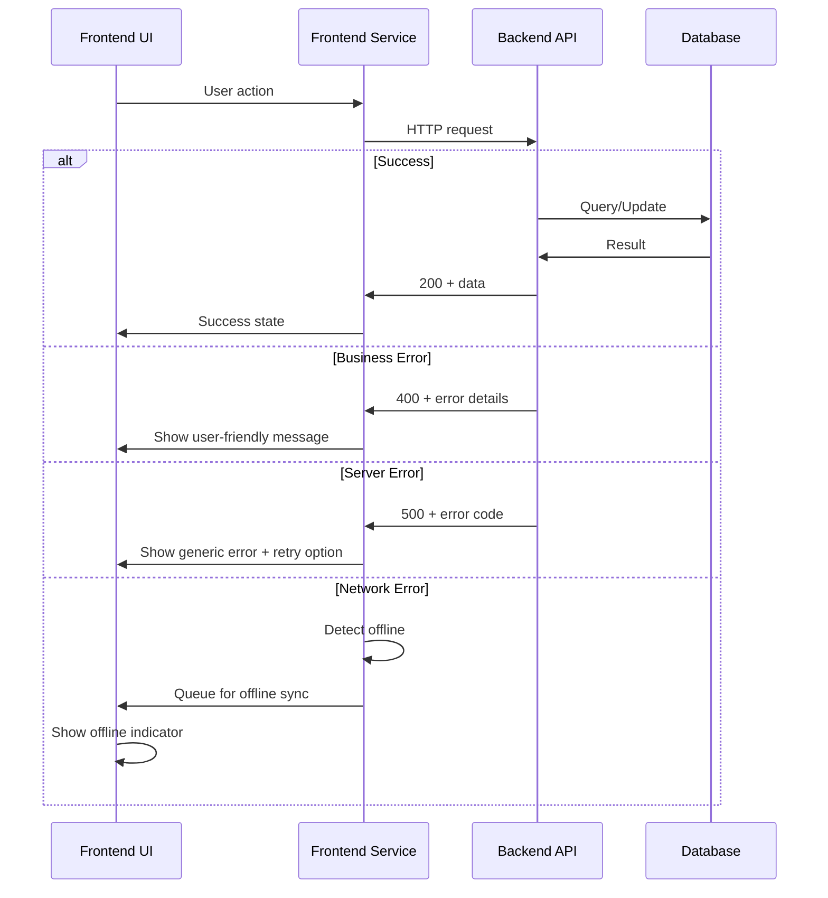

# Error Handling Strategy

## Error Flow



## Error Response Format

```typescript
interface ApiError {
  error: {
    code: string;
    message: string;
    details?: Record<string, any>;
    timestamp: string;
    requestId: string;
  };
}
```

## Frontend Error Handling

```typescript
import { notifications } from '@mantine/notifications';

class ErrorHandler {
  static handle(error: any, context?: string) {
    if (error.response) {
      // HTTP error response
      const status = error.response.status;
      const errorData = error.response.data;
      
      switch (status) {
        case 400:
          this.handleValidationError(errorData);
          break;
        case 401:
          this.handleAuthError();
          break;
        case 403:
          this.handlePermissionError();
          break;
        case 500:
          this.handleServerError(errorData);
          break;
        default:
          this.handleGenericError(error);
      }
    } else if (error.code === 'NETWORK_ERROR') {
      this.handleNetworkError();
    } else {
      this.handleGenericError(error);
    }
    
    // Log error for monitoring
    console.error(`Error in ${context}:`, error);
    
    // Send to monitoring service
    if (import.meta.env.PROD) {
      // Sentry.captureException(error);
    }
  }
  
  private static handleValidationError(errorData: any) {
    const message = errorData.error?.message || 'Données invalides';
    notifications.show({
      title: 'Erreur de validation',
      message,
      color: 'red',
    });
  }
  
  private static handleNetworkError() {
    useOfflineStore.getState().setOffline(true);
    notifications.show({
      title: 'Connexion perdue',
      message: 'Vos données sont sauvées localement et seront synchronisées automatiquement.',
      color: 'orange',
    });
  }
}

// Usage in services
export const cashService = {
  async createSale(sale: SaleCreate): Promise<Sale> {
    try {
      return await apiClient.post<Sale>('/sales', sale);
    } catch (error) {
      ErrorHandler.handle(error, 'cashService.createSale');
      throw error; // Re-throw for component handling
    }
  }
};
```

## Backend Error Handling

```typescript
from fastapi import HTTPException, Request, status
from fastapi.responses import JSONResponse
from fastapi.exception_handlers import (
    http_exception_handler,
    request_validation_exception_handler,
)
from pydantic import ValidationError
import uuid
import traceback
from datetime import datetime

class RecyclicException(Exception):
    def __init__(self, message: str, code: str = "GENERIC_ERROR", details: dict = None):
        self.message = message
        self.code = code
        self.details = details or {}
        super().__init__(message)

class BusinessLogicError(RecyclicException):
    pass

class ExternalServiceError(RecyclicException):
    pass

async def business_exception_handler(request: Request, exc: BusinessLogicError):
    return JSONResponse(
        status_code=status.HTTP_400_BAD_REQUEST,
        content={
            "error": {
                "code": exc.code,
                "message": exc.message,
                "details": exc.details,
                "timestamp": datetime.utcnow().isoformat(),
                "requestId": str(uuid.uuid4()),
            }
        },
    )

async def external_service_exception_handler(request: Request, exc: ExternalServiceError):
    # Log error for monitoring
    logger.error(f"External service error: {exc.message}", extra={
        "code": exc.code,
        "details": exc.details,
        "traceback": traceback.format_exc(),
    })
    
    return JSONResponse(
        status_code=status.HTTP_502_BAD_GATEWAY,
        content={
            "error": {
                "code": exc.code,
                "message": "Service externe temporairement indisponible",
                "details": {},
                "timestamp": datetime.utcnow().isoformat(),
                "requestId": str(uuid.uuid4()),
            }
        },
    )

async def generic_exception_handler(request: Request, exc: Exception):
    # Log error for monitoring
    logger.error(f"Unhandled exception: {str(exc)}", extra={
        "traceback": traceback.format_exc(),
        "request_url": str(request.url),
        "request_method": request.method,
    })
    
    return JSONResponse(
        status_code=status.HTTP_500_INTERNAL_SERVER_ERROR,
        content={
            "error": {
                "code": "INTERNAL_ERROR",
                "message": "Une erreur interne s'est produite",
                "details": {},
                "timestamp": datetime.utcnow().isoformat(),
                "requestId": str(uuid.uuid4()),
            }
        },
    )

# Usage in services
class CashService:
    async def create_sale(self, sale_data: SaleCreate, cashier_id: str) -> Sale:
        # Check if cash session is open
        session = await self.get_current_session(cashier_id)
        if not session or session.status != 'opened':
            raise BusinessLogicError(
                message="Aucune session de caisse ouverte",
                code="NO_OPEN_SESSION",
                details={"cashier_id": cashier_id}
            )
        
        # Validate business rules
        if sale_data.quantity <= 0:
            raise BusinessLogicError(
                message="La quantité doit être supérieure à 0",
                code="INVALID_QUANTITY",
                details={"quantity": sale_data.quantity}
            )
        
        try:
            # Create sale
            sale = Sale(**sale_data.dict(), cashier_id=cashier_id, session_id=session.id)
            db.add(sale)
            await db.commit()
            return sale
        except Exception as e:
            await db.rollback()
            logger.error(f"Failed to create sale: {e}")
            raise ExternalServiceError(
                message="Erreur lors de la sauvegarde",
                code="DATABASE_ERROR"
            )
```

---
