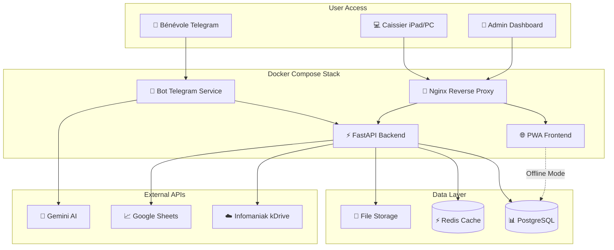

# High Level Architecture

## Technical Summary

Recyclic implémente une architecture microservices containerisée Docker avec FastAPI comme backbone API, un bot Telegram intelligent utilisant LangChain + Gemini pour la classification IA, et une PWA responsive pour l'interface caisse. Le système est conçu pour un déploiement flexible (VPS distant ou serveur local) avec mode offline robuste et synchronisation cloud automatique. L'architecture privilégie la simplicité opérationnelle pour les associations tout en assurant la conformité réglementaire via des exports automatisés Ecologic. La stack complète orchestre trois points d'entrée utilisateur (Telegram vocal, interface caisse, dashboard admin) vers un backend unifié gérant la persistence PostgreSQL et les intégrations externes.

## Platform and Infrastructure Choice

**Platform:** Docker Compose (VPS ou local)  
**Key Services:** FastAPI, PostgreSQL, Redis, Nginx  
**Deployment Host and Regions:** Europe (RGPD) - Hetzner Falkenstein ou OVH

## Repository Structure

**Structure:** Monorepo  
**Monorepo Tool:** npm workspaces  
**Package Organization:** Apps séparées (api/, bot/, web/) + packages partagés (shared/)

## High Level Architecture Diagram

## Architectural Patterns

- **Microservices Légers:** Services Docker spécialisés (bot, api, web) avec communication REST - _Rationale:_ Séparation claire des responsabilités tout en gardant la simplicité
- **PWA avec Offline-First:** Service Worker + IndexedDB pour mode hors ligne - _Rationale:_ Essentiel pour usage terrain avec connexions instables
- **Event-Driven Sync:** Queue Redis pour synchronisation cloud asynchrone - _Rationale:_ Fiabilité des exports même en cas de coupure
- **Repository Pattern:** Abstraction accès données avec interfaces TypeScript - _Rationale:_ Testabilité et flexibilité changement BDD
- **API Gateway Pattern:** Nginx comme point d'entrée unique avec SSL/routing - _Rationale:_ Sécurité et centralisation des accès

---
