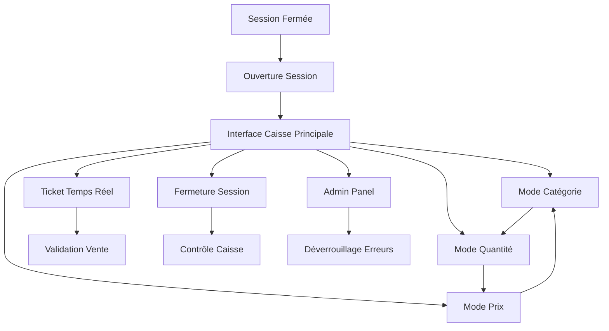
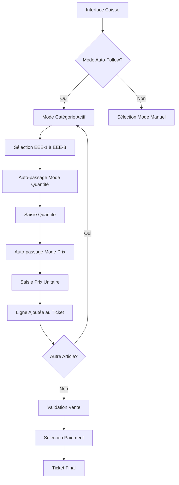
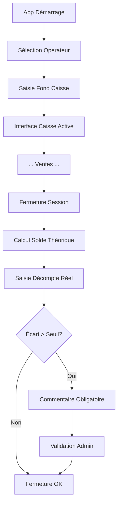
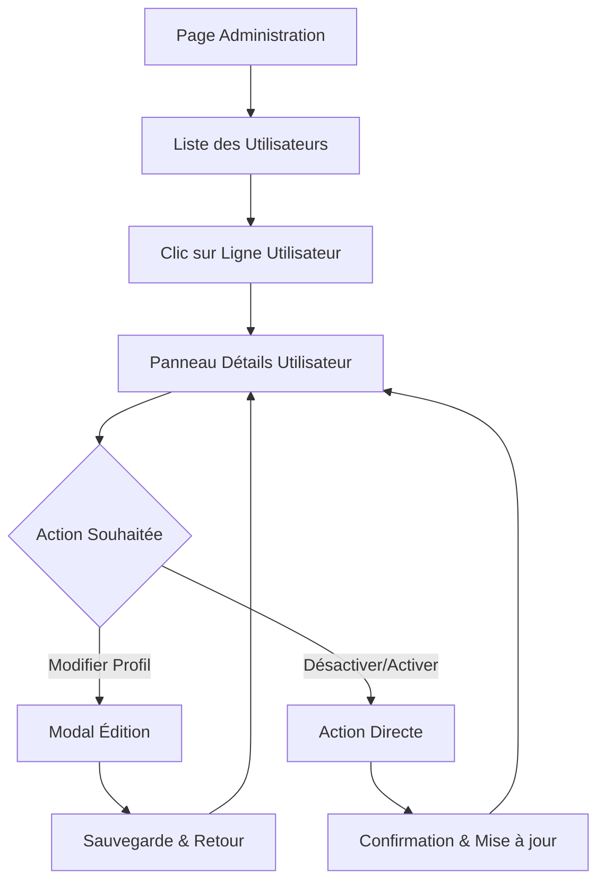

# Recyclic UI/UX Specification

**Author:** Sally (UX Expert)  
**Date:** 2025-09-09  
**Version:** 1.0  
**Status:** Ready for Development

---

## Introduction

Cette spécification définit l'expérience utilisateur, l'architecture d'information, les flux utilisateur et les spécifications de design visuel pour l'interface caisse de Recyclic. Elle sert de fondation pour le design visuel et le développement frontend, garantissant une expérience cohérente et centrée utilisateur.

## Overall UX Goals & Principles

### Target User Personas

**Opérateur de Terrain (Bénévole):**
- Âge : 35-65 ans, compétences numériques variables
- Contexte : Travail en flux, environnement parfois bruyant, tablette partagée
- Besoins : Rapidité (<15 sec/dépôt), simplicité absolue, pas de formation complexe

**Responsable Caisse:**
- Profil : Coordinateur/bénévole expérimenté
- Responsabilités : Sessions, contrôles, validation admin
- Besoins : Sécurité, rapprochement caisse, gestion erreurs

### Usability Goals

- **Facilité d'apprentissage :** Opérationnel en <10 minutes
- **Efficacité d'usage :** Vente en <5 clics, workflow 3 modes fluide
- **Prévention d'erreurs :** Validation admin pour actions critiques
- **Mémorabilité :** Interface intuitive même usage sporadique

### Design Principles

1. **Clarté avant tout** - Gros boutons, textes lisibles, actions évidentes
2. **Workflow guidé** - 3 modes séquentiels avec retour possible
3. **Robustesse tactile** - Tablette first, compatible clavier/souris
4. **Feedback immédiat** - Réponse visuelle à chaque action
5. **Persistance totale** - Zéro perte de données

### Change Log

| Date | Version | Description | Author |
|------|---------|-------------|---------|
| 2025-09-09 | 1.0 | Spécification initiale interface caisse | Sally (UX Expert) |
| 2025-09-22 | 1.1 | Ajout spécifications interface administration utilisateurs | James (Dev Agent) |

## Information Architecture (IA)

### Site Map / Screen Inventory

### Navigation Structure

**Navigation Principale :** Modes 3-boutons visuels (Catégorie/Quantité/Prix) avec état actif/inactif clair

**Navigation Secondaire :** Pavé numérique intégré, boutons retour/annulation

**Breadcrumb Strategy :** État de session visible en permanence (Opérateur, Heure ouverture, Total jour)

## User Flows

### Flow 1: Vente Standard (3 Modes Séquentiels)

**User Goal:** Enregistrer une vente rapidement avec classification EEE correcte

**Entry Points:** Interface caisse après ouverture session

**Success Criteria:** Vente enregistrée en <5 clics, ticket généré

#### Flow Diagram

#### Edge Cases & Error Handling

- **Retour arrière :** Bouton Back disponible à chaque étape, sauvegarde automatique
- **Correction ligne :** Édition libre avant validation, admin requis après
- **Session timeout :** Sauvegarde locale, restauration automatique
- **Mode offline :** Indicateur rouge discret, sync différée

#### Notes

**Workflow flexible :** Auto-follow par défaut mais navigation libre autorisée. Timeout 15min avec sauvegarde draft.

### Flow 2: Ouverture/Fermeture Session

**User Goal:** Contrôler la caisse physique de façon fiable

**Entry Points:** Application au démarrage

**Success Criteria:** Session ouverte avec fond initial, fermeture avec rapprochement

#### Flow Diagram

## Key Screen Layouts

### Écran 1: Interface Caisse Principale

**Purpose:** Hub central pour toutes les ventes avec workflow 3 modes

**Key Elements:**
- 3 boutons modes (33% largeur chacun) avec état visuel clair
- Zone catégories EEE-1 à EEE-8 (couleurs + icônes)
- Pavé numérique intégré grande taille
- Colonne ticket temps réel (33% droite)
- Barre status session (opérateur, heure, total)

**Interaction Notes:** Touch-first, mais raccourcis clavier (Tab, flèches). Auto-follow paramétrable.

### Écran 2: Ouverture Session

**Purpose:** Initialisation sécurisée de la session de caisse

**Key Elements:**
- Sélection opérateur (dropdown large)
- Saisie fond caisse (pavé numérique proéminent)
- Pré-remplissage intelligent (historique/calendrier)
- Validation avec génération ticket ouverture

**Interaction Notes:** Focus automatique sur saisie fond, validation obligatoire.

### Écran 3: Validation Admin

**Purpose:** Déverrouillage sécurisé pour actions critiques

**Key Elements:**
- Saisie PIN/mot de passe
- Description claire de l'action à valider
- Boutons Autoriser/Annuler contrastés

**Interaction Notes:** Modal overlay, timeout auto si pas d'action.

## Component Library / Design System

**Design System Approach:** Système simple et cohérent, components tactile-first

### Core Components

#### Bouton Mode (Catégorie/Quantité/Prix)
**Purpose:** Navigation principale entre les 3 modes de saisie
**Variants:** Actif (coloré + bordure), Inactif (gris), Disabled
**States:** Default, Hover, Active, Pressed
**Usage:** Largeur 33%, hauteur minimum 80px, texte 18px+

#### Bouton Catégorie EEE
**Purpose:** Sélection des 8 catégories Ecologic
**Variants:** EEE-1 à EEE-8 avec couleurs distinctes
**States:** Default, Selected, Hover
**Usage:** Grid 2x4, icônes + labels courts, sous-catégories déroulantes

#### Pavé Numérique
**Purpose:** Saisie quantité/prix optimisée tactile
**Variants:** Standard, Avec virgule décimale
**States:** Chiffres actifs, Backspace, Validation
**Usage:** Grandes touches (60px min), feedback haptic si disponible

#### Ticket Temps Réel
**Purpose:** Affichage dynamique de la vente en cours
**Variants:** Ligne standard, Ligne modifiable, Total
**States:** Normal, Edition, Validé
**Usage:** Colonne fixe droite, scroll si nécessaire

## Branding & Style Guide

### Visual Identity
**Brand Guidelines:** Système de personnalisation par ressourcerie (logo, couleurs, nom)

### Color Palette

| Color Type | Hex Code | Usage |
|------------|----------|--------|
| Primary | #8B4513 | Boutons principaux, modes actifs |
| Secondary | #CD853F | Boutons secondaires, navigation |
| Accent | #DDA0DD | Éléments interactifs, focus |
| Success | #228B22 | Validations, confirmations |
| Warning | #FF8C00 | Alertes, seuils dépassés |
| Error | #DC143C | Erreurs, actions critiques |
| Neutral | #696969 | Textes, bordures, désactivé |

### Typography

#### Font Families
- **Primary:** System fonts (Segoe UI, SF Pro, Roboto)
- **Secondary:** Sans-serif fallback
- **Monospace:** Courier New (prix, quantités)

#### Type Scale

| Element | Size | Weight | Line Height |
|---------|------|--------|-------------|
| H1 | 24px | Bold | 1.2 |
| H2 | 20px | Semi-bold | 1.3 |
| H3 | 18px | Medium | 1.4 |
| Body | 16px | Regular | 1.5 |
| Button | 18px | Medium | 1.2 |
| Small | 14px | Regular | 1.4 |

### Iconography
**Icon Library:** Feather Icons ou similaire (simple, cohérent)
**Usage Guidelines:** 24px minimum, contraste suffisant, labels texte accompagnant

### Spacing & Layout
**Grid System:** CSS Grid 12 colonnes responsive
**Spacing Scale:** 8px base (8, 16, 24, 32, 48, 64px)

## Accessibility Requirements

### Compliance Target
**Standard:** WCAG 2.1 AA (niveau praticable pour associations)

### Key Requirements

**Visual:**
- Color contrast ratios: 4.5:1 minimum pour texte
- Focus indicators: bordure 3px contrastée visible
- Text sizing: 16px minimum, zoom 200% supporté

**Interaction:**
- Keyboard navigation: Tab, flèches, Entrée, Échap
- Screen reader support: labels appropriés, rôles ARIA
- Touch targets: 44px minimum, espacés 8px+

**Content:**
- Alternative text: icônes avec labels texte
- Heading structure: hiérarchie logique H1-H3
- Form labels: explicites, liés aux champs

### Testing Strategy
Tests manuels focus clavier + lecteur d'écran basique (NVDA gratuit)

## Responsiveness Strategy

### Breakpoints

| Breakpoint | Min Width | Max Width | Target Devices |
|------------|-----------|-----------|----------------|
| Mobile | 320px | 767px | Smartphones (usage limité) |
| Tablet | 768px | 1023px | iPad, Android tablets (priorité) |
| Desktop | 1024px | 1439px | PC, Mac (usage occasionnel) |
| Wide | 1440px | - | Grands écrans (rare) |

### Adaptation Patterns

**Layout Changes:** Interface caisse optimisée 768px+, mobile en mode lecture seule

**Navigation Changes:** Modes 3-boutons horizontal tablette, vertical si nécessaire mobile

**Content Priority:** Ticket temps réel masquable sur petits écrans

**Interaction Changes:** Touch-first toujours, hover états pour souris disponible

## Animation & Micro-interactions

### Motion Principles
Animations subtiles et fonctionnelles uniquement. Pas de fioritures.

### Key Animations
- **Mode switching:** Transition fade 200ms ease-in-out
- **Button feedback:** Scale 0.95 pendant press (100ms)
- **Ticket updates:** Slide-in nouvelle ligne (300ms ease-out)
- **Error states:** Shake 300ms pour validation échouée

## Performance Considerations

### Performance Goals
- **Page Load:** <2 secondes sur connexion ADSL
- **Interaction Response:** <100ms pour actions locales
- **Animation FPS:** 60fps stable ou pas d'animation

### Design Strategies
PWA avec cache agressif, images optimisées, CSS/JS minifiés. Mode offline robuste.

## Next Steps

### Immediate Actions
1. Validation stakeholders (responsables ressourceries)
2. Création wireframes détaillés dans Figma/Sketch
3. Tests utilisabilité avec panel bénévoles
4. Handoff vers Design Architect pour spécifications techniques

### Design Handoff Checklist
- [x] All user flows documented
- [x] Component inventory complete  
- [x] Accessibility requirements defined
- [x] Responsive strategy clear
- [x] Brand guidelines incorporated
- [x] Performance goals established

## Interface d'Administration des Utilisateurs

### Vue d'ensemble

L'interface d'administration des utilisateurs permet aux super-administrateurs de gérer efficacement les utilisateurs du système avec une interface intuitive Master-Detail.

### Flow Utilisateur : Gestion des Utilisateurs

**User Goal:** Consulter, gérer et modifier le statut des utilisateurs rapidement

**Entry Points:** Menu d'administration → Gestion des Utilisateurs

**Success Criteria:** Actions administratives accomplies en moins de 3 clics

#### Flow Diagram

### Écran : Liste des Utilisateurs (Master-Detail)

**Purpose:** Interface centralisée pour la gestion des utilisateurs avec sélection simple

**Structure Layout:**
- **Colonne Gauche (50%):** Liste des utilisateurs avec filtres
- **Colonne Droite (50%):** Détails de l'utilisateur sélectionné

**Key Elements:**

#### Section Master (Liste)
- **Tableau utilisateurs** avec colonnes :
  - Nom (nom complet + username)
  - Rôle (badge non-interactif)
  - Statut d'approbation (badge coloré)
  - Statut d'activité (Actif/Inactif)
- **Filtres de recherche** : Barre de recherche, filtres par rôle et statut
- **Actions globales** : Bouton actualiser, navigation vers demandes d'inscription

#### Section Detail (Panneau Utilisateur)
- **Header utilisateur** : Avatar, nom, rôle et statuts (badges)
- **Onglets** :
  - **Profil** : Informations personnelles et système
  - **Historique** : Chronologie des activités
- **Actions principales** :
  - Bouton "Modifier le profil" (modal)
  - Bouton "Désactiver"/"Activer" (action directe)

### Interactions UX

#### Sélection d'Utilisateur
- **Pattern:** Clic sur n'importe quelle partie de la ligne utilisateur
- **Feedback:** Ligne surlignée, panneau détails mis à jour immédiatement
- **Avantage:** Plus d'actions en un clic (supprime les boutons œil/modifier/supprimer)

#### Gestion du Statut d'Activité
- **Pattern:** Bouton contextuel selon l'état actuel
  - Utilisateur actif → Bouton rouge "Désactiver"
  - Utilisateur inactif → Bouton vert "Activer"
- **Feedback:** Notification de succès + mise à jour immédiate des badges
- **Sécurité:** Les utilisateurs inactifs ne peuvent plus se connecter

#### Rôles Non-Interactifs
- **Pattern:** Affichage en badge statique (couleur selon rôle)
- **Rationale:** Évite les modifications accidentelles, change workflow intentionnel via modal

### Composants UX Spécifiques

#### Badge de Statut d'Activité
**Purpose:** Indication claire et immédiate du statut utilisateur
**Variants:**
- Actif (vert, texte "Actif")
- Inactif (rouge, texte "Inactif")
**Usage:** Colonne dédiée dans tableau, header du panneau détails

#### Ligne Utilisateur Cliquable
**Purpose:** Interaction naturelle pour la sélection
**States:** Default, Hover (légère surbrillance), Selected (surbrillance maintenue)
**Interaction:** cursor: pointer sur toute la ligne

#### Boutons d'Action Contextuels
**Purpose:** Actions directes selon l'état de l'utilisateur
**Variants:**
- "Désactiver" (outline rouge) pour utilisateurs actifs
- "Activer" (outline vert) pour utilisateurs inactifs
**States:** Default, Hover, Loading (pendant l'action)

### Accessibilité

**Keyboard Navigation:**
- Tab pour naviguer entre éléments
- Entrée pour sélectionner une ligne utilisateur
- Espace pour activer les boutons d'action

**Screen Reader Support:**
- Labels aria pour les badges de statut
- Description des actions contextuelles
- Annonce des changements de statut

**Color Contrast:**
- Badges respectent les ratios 4.5:1 minimum
- États de survol visibles sans couleur uniquement

### Responsive Behavior

**Tablette (768px+):** Layout Master-Detail côte à côte
**Mobile (<768px):** Stack vertical, panneau détails en modal ou page séparée

---

*🎨 Créé par Sally, UX Expert - Recyclic Frontend Specification v1.0*
*📝 Mis à jour par James, Dev Agent - v1.1 (Interface Administration Utilisateurs)*