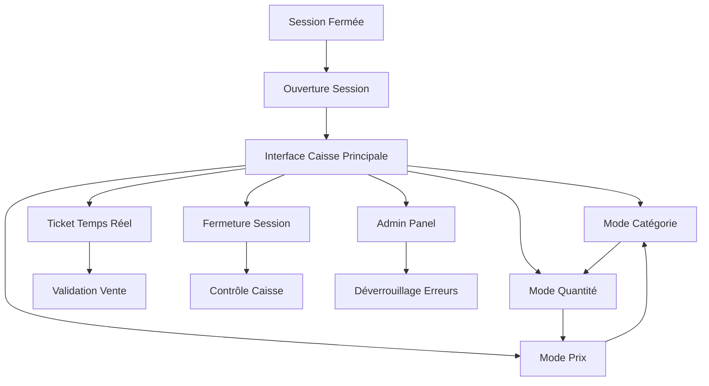

# Information Architecture (IA)

## Site Map / Screen Inventory

## Navigation Structure

**Navigation Principale :** Modes 3-boutons visuels (Catégorie/Quantité/Prix) avec état actif/inactif clair

**Navigation Secondaire :** Pavé numérique intégré, boutons retour/annulation

**Breadcrumb Strategy :** État de session visible en permanence (Opérateur, Heure ouverture, Total jour)
