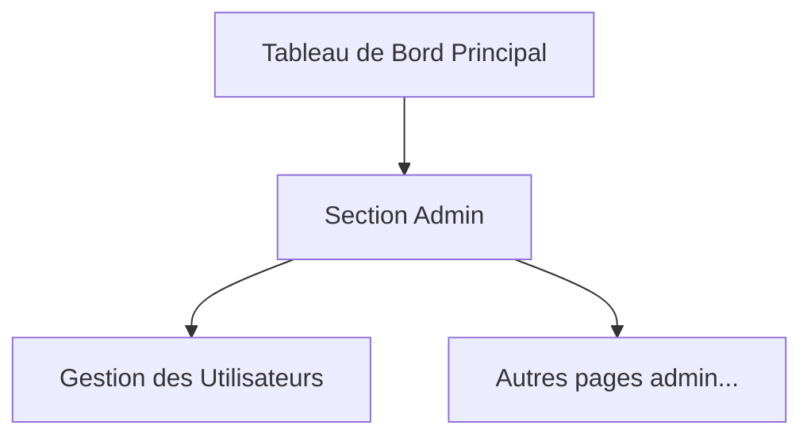
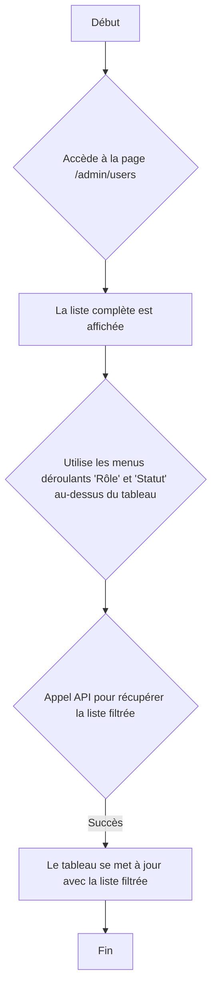

# UI/UX Specification: Gestion des Utilisateurs

**Version:** 1.0
**Date:** 2025-09-18
**Auteur:** Sally (UX Expert) & User

---

## 1. Introduction

Ce document définit les objectifs de l'expérience utilisateur, l'architecture de l'information, les flux utilisateurs et les spécifications de conception visuelle pour l'interface de **Gestion des Utilisateurs** de Recyclic. Il sert de base à la conception visuelle et au développement front-end, garantissant une expérience cohérente et centrée sur l'utilisateur.

### 1.1. Journal des Modifications

| Date       | Version | Description              | Auteur |
| ---------- | ------- | ------------------------ | ------ |
| 2025-09-18 | 1.0     | Création du document.    | Sally  |

---

## 2. Objectifs et Principes UX

### 2.1. Personas Utilisateurs Cibles

- **Persona :** L'Administrateur
- **Description :** Un utilisateur technique ou un manager qui a besoin d'un contrôle total sur les comptes utilisateurs. Il doit pouvoir gérer les permissions rapidement et avoir une vue d'ensemble claire et fiable du système. L'efficacité et la prévention des erreurs sont ses priorités.

### 2.2. Objectifs d'Utilisabilité

1.  **Efficacité :** L'administrateur doit pouvoir trouver et modifier un utilisateur rapidement.
2.  **Clarté :** La liste des utilisateurs doit être facile à lire et à filtrer.
3.  **Sécurité :** Le design doit prévenir les actions accidentelles.

### 2.3. Principes de Conception

1.  **Contrôle et Feedback :** Toujours montrer à l'administrateur l'impact de ses actions avec un retour visuel immédiat.
2.  **Clarté avant tout :** Utiliser des libellés clairs et une disposition qui ne laisse pas de place à l'ambiguïté.
3.  **Simplicité :** Fournir une seule méthode claire pour modifier un utilisateur afin de garantir la cohérence.

---

## 3. Architecture de l'Information

### 3.1. Plan du Site



### 3.2. Structure de Navigation

- **Navigation Primaire :** La barre de navigation principale contiendra un lien "Admin", visible uniquement par les administrateurs.
- **Navigation Secondaire :** Dans la section "Admin", une barre latérale à gauche contiendra le lien vers "Gestion des Utilisateurs".
- **Fil d'Ariane :** Un fil d'Ariane (`Accueil > Admin > Gestion des Utilisateurs`) sera présent.

---

## 4. Flux Utilisateurs

### 4.1. Flux Principal : Consultation et Modification

- **Objectif :** Consulter, filtrer et modifier les informations, le rôle ou le statut d'un utilisateur.
- **Interaction :** L'interface utilise un layout "Master-Detail". Une seule action "Modifier" ouvre une modale contenant tous les champs éditables, suite à la décision de privilégier la simplicité et la cohérence pour des actions jugées rares.

```mermaid
graph TD
    A[Début] --> B{Accède à la page /admin/users};
    B --> C{Localise l'utilisateur dans le tableau};
    C --> D{Clique sur un bouton/icône "Modifier" sur la ligne de l'utilisateur};
    D --> E[Une fenêtre modale (pop-up) s'ouvre avec tous les champs du profil : Nom, Rôle, Statut, etc.];
    E --> F{Modifie les informations dans le formulaire};
    F --> G{Clique sur le bouton "Enregistrer" dans la modale};
    G --> H{Appel API pour mettre à jour le profil};
    H -- Succès --> I[La modale se ferme et une notification de succès est affichée];
    I --> J[Le tableau se met à jour];
    J --> L[Fin];
    H -- Échec --> M[Un message d'erreur s'affiche dans la modale];
    M --> F;
```

### 4.2. Flux Secondaire : Filtrage



---

## 5. Wireframes & Mockups

### 5.1. Layout de l'Écran Principal (Vue Master-Detail)

- **Objectif :** Fournir une interface efficace pour parcourir, visualiser et modifier les utilisateurs.
- **Panneau de Gauche (Liste "Master") :**
    - Contient les contrôles de filtre (Rôle, Statut).
    - Affiche le tableau des utilisateurs avec colonnes triables.
- **Panneau de Droite (Vue "Détail") :**
    - Affiche les détails complets de l'utilisateur sélectionné.
    - Contient le formulaire d'édition avec les boutons "Enregistrer" et "Annuler".
    - Affiche un message d'invitation si aucun utilisateur n'est sélectionné.

### 5.2. Fichiers de Design

- Les maquettes haute-fidélité basées sur ce document seront disponibles sur Figma (lien à ajouter).

---

## 6. Bibliothèque de Composants & Style

### 6.1. Approche

- **Bibliothèque :** Material-UI (MUI) pour React.
- **Icônes :** Material Icons (fournies avec MUI).
- **Espacement :** Standard de MUI (base 8px).

### 6.2. Palette de Couleurs (Basée sur le logo)

- **Primaire (Violet prune) :** `#86506F`
- **Secondaire (Vert olive) :** `#566940`
- **Fond Principal (Beige clair) :** `#F7EFDF`
- **Accent (Orange brique) :** `#B65C24`
- **Texte Principal (Gris anthracite) :** `#2B2B2B`

### 6.3. Typographie

- **Police Principale :** 'Inter', sans-serif.
- **Police Monospace :** 'Roboto Mono'.

---

## 7. Accessibilité & Responsiveness

### 7.1. Accessibilité

- **Objectif :** WCAG 2.1, Niveau AA.
- **Exigences :** Navigation clavier complète, support des lecteurs d'écran, contrastes de couleurs suffisants, textes alternatifs pour les images.

### 7.2. Responsiveness

- **Desktop (> 900px) :** Vue Master-Detail (liste à gauche, détails à droite).
- **Tablette & Mobile (< 900px) :** La vue se transforme. La liste s'affiche en pleine largeur. Un clic sur un utilisateur navigue vers une nouvelle page affichant les détails en pleine largeur.

---

## 8. Prochaines Étapes

### 8.1. Dépendances Backend (Nouveaux Besoins)

**IMPORTANT :** Contrairement à la prémisse de la story originale, le design finalisé requiert des développements backend qui n'existaient pas :

1.  **Endpoint de mise à jour du statut :** Une route API (ex: `PUT /api/v1/admin/users/{user_id}/status`) est nécessaire pour gérer l'activation/désactivation.
2.  **Endpoint de mise à jour du profil :** Une route API (ex: `PUT /api/v1/admin/users/{user_id}`) est nécessaire pour modifier les détails du profil (nom, etc.).

### 8.2. Actions Immédiates

1.  Revue de ce document par les parties prenantes.
2.  Création des maquettes haute-fidélité.
3.  Handoff aux développeurs.

