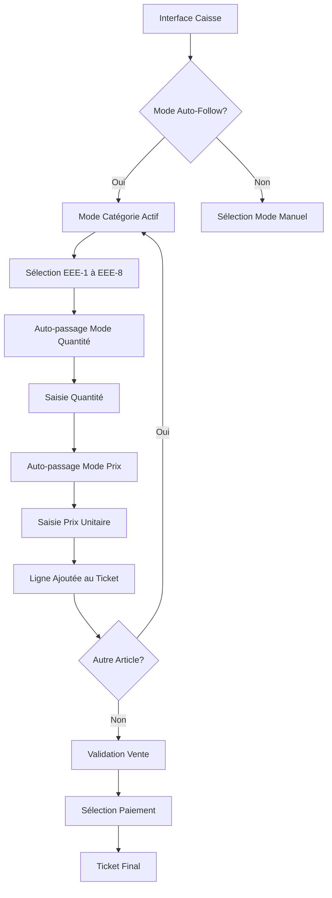
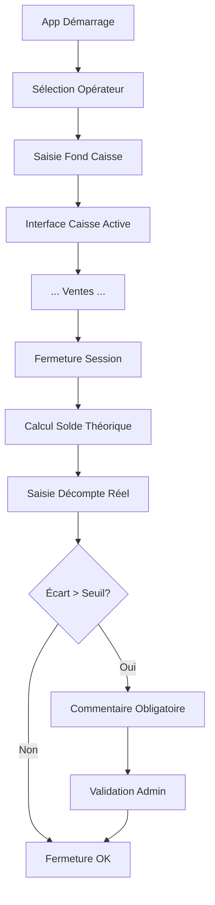

# User Flows

## Flow 1: Vente Standard (3 Modes Séquentiels)

**User Goal:** Enregistrer une vente rapidement avec classification EEE correcte

**Entry Points:** Interface caisse après ouverture session

**Success Criteria:** Vente enregistrée en <5 clics, ticket généré

### Flow Diagram

### Edge Cases & Error Handling

- **Retour arrière :** Bouton Back disponible à chaque étape, sauvegarde automatique
- **Correction ligne :** Édition libre avant validation, admin requis après
- **Session timeout :** Sauvegarde locale, restauration automatique
- **Mode offline :** Indicateur rouge discret, sync différée

### Notes

**Workflow flexible :** Auto-follow par défaut mais navigation libre autorisée. Timeout 15min avec sauvegarde draft.

## Flow 2: Ouverture/Fermeture Session

**User Goal:** Contrôler la caisse physique de façon fiable

**Entry Points:** Application au démarrage

**Success Criteria:** Session ouverte avec fond initial, fermeture avec rapprochement

### Flow Diagram

