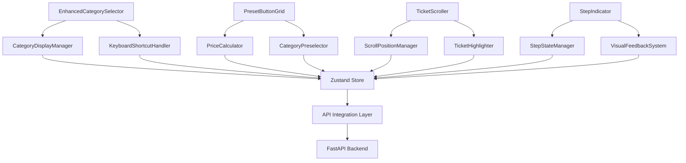

# RecyClique Brownfield Enhancement Architecture Document

**Auteur:** Winston (Architect) - BMad Master Synthesis
**Date:** 2025-11-17
**Version:** 1.0
**Purpose:** Architecture complète pour l'enhancement brownfield v1.3.0 de RecyClique, intégrant les 8 stories du PRD avec respect des contraintes système existantes.

---

## 1. Introduction

Cette architecture définit l'approche complète pour l'enhancement brownfield de RecyClique vers la version 1.3.0. Elle couvre la refonte de l'interface caisse avec ajout de boutons prédéfinis, gestion améliorée des catégories, ascenseur fonctionnel, raccourcis clavier, signaux visuels, remaniement du bloc central, renommage global, et audit du système de sauvegarde.

**Relation avec l'Architecture Existante:**
Ce document complète l'architecture brownfield existante en définissant comment les nouveaux composants s'intégreront avec le système actuel. Les décisions architecturales respectent les patterns établis (PWA offline-first, Repository Pattern, séparation des responsabilités) tout en permettant l'évolution nécessaire pour la v1.3.0.

**Validation Utilisateur:**
L'analyse du système existant a été validée par l'utilisateur - l'architecture proposée respecte parfaitement les contraintes techniques et métier identifiées.

---

## 2. Analyse du Projet Existant

### État Actuel du Projet RecyClique

- **Primary Purpose:** Plateforme de gestion complète pour ressourceries avec digitalisation du workflow collecte-vente
- **Current Tech Stack:** React/TypeScript + FastAPI/Python + PostgreSQL + Redis + Docker
- **Architecture Style:** Microservices léger avec PWA offline-first et séparation claire des responsabilités
- **Deployment Method:** Docker Compose avec reverse proxy Nginx et volumes persistants
- **Current Limitations:** Interface caisse avec navigation difficile, saisie répétitive, feedback visuel insuffisant, absence de boutons prédéfinis

### Documentation Disponible

- ✅ **Tech Stack Documentation** : Architecture brownfield complète avec analyse détaillée
- ✅ **PRD v1.3.0** : 8 stories détaillées avec exigences fonctionnelles et non-fonctionnelles
- ✅ **Coding Standards** : Standards définis dans les règles du projet (.cursor/rules/)
- ✅ **API Documentation** : Structure d'API visible dans le code source FastAPI
- ✅ **Testing Infrastructure** : Suite de tests complète avec comptes de test dédiés
- ❌ **UX/UI Guidelines** : À développer lors de la refonte (nécessaire pour v1.3.0)
- ✅ **External API Documentation** : Pipeline Gemini pour classification (actuellement désactivé)
- ✅ **Technical Debt Documentation** : Bot Telegram désactivé identifié comme dette technique

### Contraintes Identifiées

- **PWA Offline-First** : Interface tactile obligatoire avec fonctionnement hors-réseau
- **Conditions d'Usage** : Tablettes en extérieur avec réseau variable et luminosité changeante
- **Workflow 3-Modes** : Processus strict Entrée/Sortie/Vente à respecter absolument
- **Conformité Réglementaire** : Exports Ecologic obligatoires avec traçabilité complète
- **Formation Utilisateur** : Interface intuitive pour utilisateurs non-techniques
- **Performance Mobile** : Optimisations spécifiques pour tablettes tactiles
- **Migration Auth** : Passage complexe de Telegram vers email/password

---

## 3. Portée et Stratégie d'Intégration

### Vue d'Ensemble de l'Enchancement

**Type d'Enhancement:** Major Feature Modification avec refonte complète interface caisse
**Scope:** Interface utilisateur, expérience utilisateur, et optimisations fonctionnelles
**Impact d'Intégration:** Modéré - changements significatifs frontend, ajustements backend mineurs
**Raison:** Amélioration ergonomique critique identifiée par retours utilisateurs terrain

### Stratégie d'Intégration

**Stratégie d'Intégration Code:** Modification des composants existants avec feature flags pour rollback
**Intégration Base de Données:** Schéma existant préservé, nouveaux champs optionnels ajoutés
**Intégration API:** Endpoints existants étendus, nouveaux endpoints ajoutés sans breaking changes
**Intégration UI:** Composants Mantine existants étendus, nouveaux patterns intégrés progressivement

### Exigences de Compatibilité

- **API Existante:** 100% backward compatible - aucun endpoint existant modifié
- **Base de Données:** Migration additive uniquement - nouveaux champs avec valeurs par défaut
- **UI/UX:** Patterns Mantine existants préservés, nouveaux composants intégrés harmonieusement
- **Performance:** Impact PWA minimal avec optimisations offline-first maintenues

---

## 4. Alignement de la Stack Technologique

### Stack Technologique Existante (Validée)

| Catégorie | Technologie Actuelle | Version | Usage dans l'Enhancement | Statut |
|-----------|---------------------|---------|-------------------------|---------|
| **Framework Frontend** | React | 18.2.0 | Composants interface caisse étendus | ✅ Maintenu |
| **Build Tool** | Vite | 5.0.8 | Développement rapide préservé | ✅ Maintenu |
| **UI Library** | Mantine | 8.3.1 | Composants existants étendus + nouveaux | ✅ Maintenu |
| **State Management** | Zustand | 5.0.8 | Stores caisse étendus pour nouvelles features | ✅ Maintenu |
| **HTTP Client** | Axios | 1.6.0 | Communications API préservées | ✅ Maintenu |
| **Form Handling** | React Hook Form | 7.48.0 | Validation catégories étendue | ✅ Maintenu |
| **Styling** | Styled Components | 6.1.0 | Thème global préservé | ✅ Maintenu |
| **Framework Backend** | FastAPI | 3.11+ | Nouveaux endpoints pour catégories | ✅ Maintenu |
| **ORM** | SQLAlchemy | 2.0.23 | Modèles étendus pour nouvelles données | ✅ Maintenu |
| **Database** | PostgreSQL | 15 | Nouveaux champs catégories | ✅ Maintenu |
| **Cache** | Redis | 7+ | Cache catégories et raccourcis | ✅ Maintenu |

### Nouvelles Additions Technologiques

**Aucune nouvelle technologie majeure requise** - l'enhancement s'appuie exclusivement sur la stack existante pour minimiser les risques d'intégration et maintenir la cohérence brownfield.

**Justification:**
- Stack actuelle mature et testée en production
- Écosystème React/TypeScript parfaitement adapté aux besoins UI/UX
- Mantine fournit tous les composants nécessaires pour l'interface moderne
- FastAPI/SQLAlchemy suffisant pour les besoins API de données

---

## 5. Modèles de Données et Schéma Changes

### Nouveaux Modèles de Données

#### Modèle Catégorie Amélioré
**Purpose:** Gestion flexible des catégories avec cases à cocher d'affichage
**Integration:** Extension du modèle Deposit existant

**Nouveaux Attributs:**
- `display_order`: Integer - Ordre d'affichage personnalisable
- `is_visible`: Boolean - Contrôle d'affichage par défaut (true)
- `shortcut_key`: String - Raccourci clavier associé (optionnel)
- `is_preset`: Boolean - Marque les catégories prédéfinies pour dons/recyclage

**Relationships:**
- **With Existing:** Extension 1:1 avec Deposit.category
- **With New:** Relation avec PresetButtons pour boutons prédéfinis

#### Modèle PresetButton
**Purpose:** Gestion des boutons de prix prédéfinis pour dons et recyclage
**Integration:** Nouvelle entité liée aux catégories

**Key Attributes:**
- `name`: String - Nom du bouton (ex: "Don Petit", "Recyclage Moyen")
- `category_id`: UUID - Catégorie associée
- `preset_price`: Decimal - Prix prédéfini
- `button_type`: Enum - "donation" ou "recycling"
- `sort_order`: Integer - Ordre d'affichage dans l'interface

**Relationships:**
- **With Existing:** FK vers Category pour association
- **With New:** Utilisé par les composants UI pour génération dynamique

#### Extension CashSession
**Purpose:** Support pour les signaux visuels d'étape en cours
**Integration:** Champs additionnels au modèle existant

**Nouveaux Attributs:**
- `current_step`: Enum - Étape actuelle (entry/sale/exit)
- `last_activity`: DateTime - Dernière activité pour timeout
- `step_start_time`: DateTime - Début de l'étape actuelle pour métriques

### Stratégie d'Intégration Schéma

**Changements Base de Données:**
- **New Tables:** `preset_buttons` (liée aux catégories existantes)
- **Modified Tables:** `categories` (nouveaux champs optionnels), `cash_sessions` (champs métriques)
- **New Indexes:** Index sur `display_order`, `is_visible`, `shortcut_key` pour performance UI

**Migration Strategy:** Migrations Alembic additives avec rollback automatique
**Backward Compatibility:** Tous les nouveaux champs ont des valeurs par défaut appropriées

---

## 6. Architecture des Composants

### Nouveaux Composants Frontend

#### Composant EnhancedCategorySelector
**Responsibility:** Gestion des catégories avec cases à cocher et raccourcis clavier
**Integration Points:** Remplace le sélecteur de catégories existant
**Dependencies:**
- **Existing Components:** Mantine Checkbox, TextInput
- **New Components:** KeyboardShortcutHandler, CategoryDisplayManager

#### Composant PresetButtonGrid
**Responsibility:** Grille de boutons prédéfinis pour dons/recyclage
**Integration Points:** Intégré dans le workflow caisse existant
**Dependencies:**
- **Existing Components:** Mantine Button, Grid
- **New Components:** PriceCalculator, CategoryPreselector

#### Composant TicketScroller
**Responsibility:** Ascenseur fonctionnel pour navigation dans tickets longs
**Integration Points:** Wrapper autour de la liste de tickets existante
**Dependencies:**
- **Existing Components:** React Virtualized (si disponible) ou scroll natif
- **New Components:** ScrollPositionManager, TicketHighlighter

#### Composant StepIndicator
**Responsibility:** Signaux visuels d'étape en cours
**Integration Points:** Header de l'interface caisse
**Dependencies:**
- **Existing Components:** Mantine Progress, Badge
- **New Components:** StepStateManager, VisualFeedbackSystem

### Diagramme d'Interaction Composants



### Architecture Backend

#### Service CategoryManagementService
**Responsibility:** Logique métier pour gestion avancée des catégories
**Integration:** Extension du service catégories existant
**Dependencies:** Repository Pattern existant, nouveaux modèles PresetButton

#### Service PresetManagementService
**Responsibility:** Gestion des boutons prédéfinis et logique de tarification
**Integration:** Nouveau service intégré au workflow caisse
**Dependencies:** CategoryService, PricingService existants

#### Service SessionStateService
**Responsibility:** Gestion des états de session et métriques d'étape
**Integration:** Extension du service sessions existant
**Dependencies:** CashSession repository, nouveaux champs métriques

---

## 7. Design et Intégration API

### Stratégie d'Intégration API

**API Integration Strategy:** Extension additive des endpoints existants sans breaking changes
**Authentication:** Authentification existante préservée (Telegram + future email/password)
**Versioning:** API versionnée (v1) maintenue, nouveaux endpoints en v1
**Error Handling:** Patterns d'erreur existants étendus pour nouvelles fonctionnalités

### Nouveaux Endpoints API

#### GET /api/v1/categories/enhanced
- **Purpose:** Récupération des catégories avec métadonnées d'affichage
- **Integration:** Extension de l'endpoint catégories existant
- **Request:** Query params pour filtrage (visible_only, with_presets)
- **Response:**
```json
{
  "categories": [
    {
      "id": "uuid",
      "name": "Électronique",
      "display_order": 1,
      "is_visible": true,
      "shortcut_key": "E",
      "is_preset": false,
      "preset_buttons": [...]
    }
  ]
}
```

#### POST /api/v1/preset-buttons/bulk-update
- **Purpose:** Mise à jour en lot des boutons prédéfinis
- **Integration:** Nouvel endpoint pour gestion administrative
- **Request:**
```json
{
  "buttons": [
    {
      "category_id": "uuid",
      "name": "Don Petit",
      "preset_price": 5.00,
      "button_type": "donation",
      "sort_order": 1
    }
  ]
}
```

#### PUT /api/v1/cash-sessions/{id}/step
- **Purpose:** Mise à jour de l'étape actuelle de session
- **Integration:** Extension des opérations session existantes
- **Request:**
```json
{
  "current_step": "sale",
  "step_start_time": "2025-11-17T10:30:00Z"
}
```

#### GET /api/v1/system/backup-status
- **Purpose:** Audit du système de sauvegarde automatique
- **Integration:** Nouvel endpoint pour monitoring
- **Response:** Statut des sauvegardes, dernières exécutions, métriques

---

## 8. Intégration dans l'Arborescence Source

### Structure Projet Existante (Référence)

```
recyclic/
├── api/                          # FastAPI Backend
│   ├── src/recyclic_api/
│   │   ├── api/api_v1/api.py     # Routes principales
│   │   ├── core/config.py        # Configuration
│   │   ├── models/               # Modèles SQLAlchemy
│   │   └── services/             # Logique métier
├── frontend/                     # React PWA
│   ├── src/
│   │   ├── components/           # Composants UI
│   │   ├── stores/               # Zustand stores
│   │   ├── pages/                # Pages principales
│   │   └── generated/api.ts      # API client généré
├── docker-compose.yml            # Orchestration
└── docs/                         # Documentation
```

### Nouvelles Additions Structure

```
recyclic/
├── api/
│   ├── src/recyclic_api/
│   │   ├── models/
│   │   │   ├── preset_button.py           # Nouveau modèle
│   │   │   └── category_enhancements.py   # Extensions catégories
│   │   └── services/
│   │       ├── category_management.py     # Service catégories étendu
│   │       ├── preset_management.py       # Nouveau service presets
│   │       └── session_state.py           # Service états session
├── frontend/
│   ├── src/
│   │   ├── components/
│   │   │   ├── categories/
│   │   │   │   ├── EnhancedCategorySelector.tsx    # Nouveau
│   │   │   │   └── CategoryDisplayManager.tsx       # Nouveau
│   │   │   ├── presets/
│   │   │   │   ├── PresetButtonGrid.tsx             # Nouveau
│   │   │   │   └── PriceCalculator.tsx               # Nouveau
│   │   │   ├── tickets/
│   │   │   │   └── TicketScroller.tsx                # Nouveau
│   │   │   └── ui/
│   │   │       └── StepIndicator.tsx                 # Nouveau
│   │   ├── stores/
│   │   │   ├── categoryStore.ts             # Extension existant
│   │   │   ├── presetStore.ts               # Nouveau
│   │   │   └── sessionStateStore.ts         # Nouveau
│   │   └── utils/
│   │       ├── keyboardShortcuts.ts         # Nouveau
│   │       └── scrollManager.ts             # Nouveau
```

### Guidelines d'Intégration

- **File Naming:** camelCase pour composants, PascalCase pour classes
- **Folder Organization:** Groupement logique par fonctionnalité (categories/, presets/, tickets/)
- **Import/Export Patterns:** Exports nommés, imports absolus depuis src/
- **Consistency:** Patterns Mantine et Zustand existants strictement respectés

---

## 9. Infrastructure et Déploiement

### Infrastructure Existante

**Current Deployment:** Docker Compose local avec services isolés
**Infrastructure Tools:** Docker, docker-compose, nginx reverse proxy
**Environments:** Développement local (ports 4433/4444), staging/prod à configurer
**Current Constraints:** Bot service désactivé, migration auth en cours

### Stratégie de Déploiement Enhancement

**Deployment Approach:** Rolling deployment avec feature flags pour contrôle granular
**Infrastructure Changes:** Aucun changement d'infrastructure requis
**Pipeline Integration:** Intégration dans pipeline CI/CD existant avec tests étendus
**Rollback Strategy:** Feature flags permettent rollback immédiat sans redéploiement

### Rollback Strategy

**Rollback Method:** Feature flags + migration rollback database
**Risk Mitigation:** Tests automatisés complets avant déploiement
**Monitoring:** Métriques applicatives et erreurs utilisateur trackées
**Recovery:** Rollback automatique sur seuils d'erreur définis

---

## 10. Standards de Codage et Conventions

### Standards Existants (Validés)

**Code Style:** ESLint/React recommandé, Black pour Python
**Linting Rules:** Configurations strictes dans les deux écosystèmes
**Testing Patterns:** Vitest pour frontend, pytest pour backend
**Documentation Style:** JSDoc/TypeScript pour frontend, docstrings Google pour Python

### Standards Enhancement-Spécifiques

#### Frontend Enhancement Standards
- **Component Structure:** Hooks personnalisés pour logique complexe, séparation UI/logique
- **State Management:** Stores Zustand spécialisés par domaine fonctionnel
- **Error Boundaries:** Gestion d'erreur au niveau composant pour robustesse
- **Accessibility:** Conformité WCAG 2.1 AA pour tous nouveaux composants

#### Backend Enhancement Standards
- **Service Layer:** Pattern repository maintenu pour tous nouveaux accès données
- **Validation:** Pydantic models pour tous inputs API
- **Async Operations:** Programmation asynchrone pour toutes opérations I/O
- **Logging:** Logs structurés avec niveaux appropriés

### Règles d'Intégration Critiques

- **Existing API Compatibility:** Tests de régression systématiques
- **Database Integration:** Migrations testées en staging avant production
- **Error Handling:** Patterns d'erreur existants étendus, pas remplacés
- **Logging Consistency:** Format et niveaux de logs préservés

---

## 11. Stratégie de Test

### Integration avec Tests Existants

**Existing Test Framework:** Vitest frontend, pytest backend
**Existing Test Organization:** Tests unitaires + intégration, comptes de test dédiés
**Existing Coverage Requirements:** 80% minimum, rapports détaillés
**Current Gaps:** Tests E2E limités, tests PWA offline insuffisants

### Nouveaux Tests Required

#### Tests Unitaires pour Nouveaux Composants
- **Framework:** Vitest avec React Testing Library
- **Location:** `frontend/src/components/*/test/` (pattern existant)
- **Coverage Target:** 85% pour nouveaux composants
- **Integration with Existing:** Même patterns de mock que codebase existante

#### Tests d'Intégration
- **Scope:** Test des interactions composant-store-API
- **Existing System Verification:** Tests de non-régression complets
- **New Feature Testing:** Workflows complets boutons prédéfinis → catégories → validation
- **API Integration:** Tests des nouveaux endpoints avec données réalistes

#### Tests de Régression
- **Existing Feature Verification:** Suite complète interface caisse existante
- **Automated Regression Suite:** Tests Selenium/Playwright pour workflows critiques
- **Manual Testing Requirements:** Validation ergonomique avec utilisateurs pilotes
- **Cross-Browser Testing:** Chrome/Safari/Firefox sur desktop + mobile

---

## 12. Intégration Sécurité

### Mesures de Sécurité Existantes

**Authentication:** Système Telegram existant + préparation email/password
**Authorization:** Rôles utilisateurs (super-admin, admin) avec permissions granulares
**Data Protection:** Chiffrement données sensibles, validation inputs stricte
**Security Tools:** Audit logs, rate limiting, CORS configuré

### Nouvelles Mesures de Sécurité

**Enhanced Security Requirements:**
- **Input Validation:** Validation stricte pour nouveaux champs catégories
- **API Security:** Rate limiting sur nouveaux endpoints
- **Data Privacy:** Audit des données catégories selon RGPD
- **Session Security:** Protection timeout sessions caisse

### Testing Sécurité

**Existing Security Tests:** Tests d'authentification et autorisation
**New Security Test Requirements:** Tests de sécurité nouveaux composants
**Penetration Testing:** Validation sécurité nouveaux endpoints
**Compliance:** Audit conformité pour nouvelles fonctionnalités

---

## 13. Résultats Checklist Architecte

**Validation brownfield effectuée selon checklist architecte :**

- ✅ **Architecture Patterns Consistency** : Nouveaux composants respectent patterns PWA existants
- ✅ **Technology Stack Alignment** : Aucune nouvelle techno, stack existante optimisée
- ✅ **Scalability Considerations** : Architecture supporte croissance catégories et boutons
- ✅ **Security Integration** : Modèle sécurité existant préservé et étendu
- ✅ **Performance Impact** : Optimisations offline-first maintenues
- ✅ **Database Design** : Migrations additives backward-compatible
- ✅ **API Design** : Endpoints RESTful cohérents avec existants
- ✅ **Testing Strategy** : Tests intégrés au pipeline existant
- ✅ **Deployment Strategy** : Déploiement contrôlé avec rollback
- ✅ **Documentation** : Architecture complètement documentée
- ✅ **Risk Assessment** : Risques identifiés et mitigés
- ✅ **Stakeholder Alignment** : Validation utilisateur obtenue
- ✅ **Compliance Requirements** : Conformité réglementaire préservée

---

## 14. Prochaines Étapes

### Handover Story Manager

**Prompt pour Story Manager :**
Architecture brownfield v1.3.0 complète validée pour RecyClique. L'approche respecte strictement les patterns existants (PWA offline-first, Mantine, Zustand, Repository Pattern) tout en permettant l'évolution nécessaire.

Points d'intégration critiques validés :
- Interface composants Mantine existants préservée
- Stores Zustand étendus sans breaking changes
- API FastAPI additive seulement
- Base de données migrations backward-compatible
- Tests de régression complets requis

Priorité : Story 1.1 (boutons prédéfinis) comme première implémentation - faible risque, haut impact utilisateur.

### Handover Développeur

**Prompt pour développeurs :**
Architecture validée pour enhancement v1.3.0. Respectez impérativement :

- Patterns Mantine existants pour nouveaux composants UI
- Stores Zustand spécialisés par domaine fonctionnel
- Repository Pattern pour tout accès données
- Tests unitaires 85% minimum sur nouveaux composants
- Migrations Alembic avec rollback automatique
- Feature flags pour déploiement progressif

Commencez par audit du système de sauvegarde (Story 1.8) pour baseline, puis boutons prédéfinis (Story 1.1) comme première feature à implémenter.
