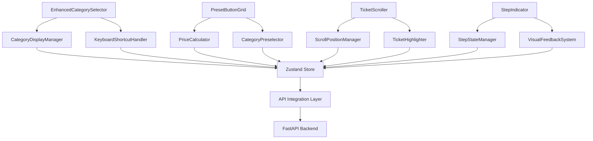

# 6. Architecture des Composants

### Nouveaux Composants Frontend

#### Composant EnhancedCategorySelector
**Responsibility:** Gestion des catégories avec cases à cocher et raccourcis clavier
**Integration Points:** Remplace le sélecteur de catégories existant
**Dependencies:**
- **Existing Components:** Mantine Checkbox, TextInput
- **New Components:** KeyboardShortcutHandler, CategoryDisplayManager

#### Composant PresetButtonGrid
**Responsibility:** Grille de boutons prédéfinis pour dons/recyclage
**Integration Points:** Intégré dans le workflow caisse existant
**Dependencies:**
- **Existing Components:** Mantine Button, Grid
- **New Components:** PriceCalculator, CategoryPreselector

#### Composant TicketScroller
**Responsibility:** Ascenseur fonctionnel pour navigation dans tickets longs
**Integration Points:** Wrapper autour de la liste de tickets existante
**Dependencies:**
- **Existing Components:** React Virtualized (si disponible) ou scroll natif
- **New Components:** ScrollPositionManager, TicketHighlighter

#### Composant StepIndicator
**Responsibility:** Signaux visuels d'étape en cours
**Integration Points:** Header de l'interface caisse
**Dependencies:**
- **Existing Components:** Mantine Progress, Badge
- **New Components:** StepStateManager, VisualFeedbackSystem

### Diagramme d'Interaction Composants

### Architecture Backend

#### Service CategoryManagementService
**Responsibility:** Logique métier pour gestion avancée des catégories
**Integration:** Extension du service catégories existant
**Dependencies:** Repository Pattern existant, nouveaux modèles PresetButton

#### Service PresetManagementService
**Responsibility:** Gestion des boutons prédéfinis et logique de tarification
**Integration:** Nouveau service intégré au workflow caisse
**Dependencies:** CategoryService, PricingService existants

#### Service SessionStateService
**Responsibility:** Gestion des états de session et métriques d'étape
**Integration:** Extension du service sessions existant
**Dependencies:** CashSession repository, nouveaux champs métriques

---

