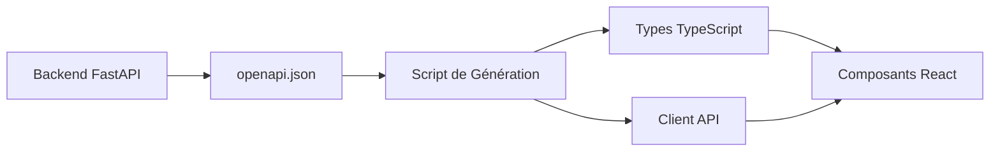

## Codegen API (Frontend)

Après toute modification d'`openapi.json` ou intégration du client, exécuter:

```bash
npm run codegen
```

Prérequis:
- `VITE_API_URL` défini dans `.env` ou `.env.local` (ex: `http://localhost:8000`).
- Le client généré importe l'instance centralisée `src/api/axiosClient` et ne crée pas d'instance axios propre.

Sortie:
- Types et client dans `src/generated/`.
# Génération de Code API - Guide Technique

## Vue d'Ensemble

Ce document explique le processus de génération automatique de code TypeScript à partir de la spécification OpenAPI du backend. Ce système élimine la duplication manuelle de code et garantit la cohérence des types entre le frontend et le backend.

## Architecture du Système



## Processus de Génération

### 1. Génération du fichier OpenAPI

Le backend FastAPI génère automatiquement un fichier `openapi.json` contenant :
- Tous les endpoints de l'API
- Les schémas de données (modèles Pydantic)
- Les types de paramètres et réponses
- La documentation des endpoints

### 2. Script de Génération

Le script `scripts/generate-api.js` :
- Lit le fichier `openapi.json`
- Génère les types TypeScript correspondants
- Crée le client API avec méthodes typées
- Met à jour les fichiers dans `src/generated/`

### 3. Utilisation dans le Code

Les composants et services importent les types et l'API générés :

```typescript
// Import des types
import { UserResponse, UserRole, UserStatus } from '../generated';

// Import de l'API
import { UsersApi } from '../generated';

// Utilisation typée
const users: UserResponse[] = await UsersApi.getUsers();
```

## Fichiers Générés

### `src/generated/types.ts`

Contient tous les types TypeScript :
- Interfaces pour les modèles de données
- Enums pour les valeurs constantes
- Types pour les réponses API
- Types d'erreur

### `src/generated/api.ts`

Contient le client API :
- Classes pour chaque groupe d'endpoints
- Méthodes typées pour chaque endpoint
- Configuration Axios
- Gestion des erreurs

### `src/generated/index.ts`

Point d'entrée pour tous les exports :
- Re-export de tous les types
- Re-export de l'API
- Export par défaut du client

## Workflow de Développement

### Quand Exécuter la Génération

1. **Après modification de l'API backend**
2. **Avant de développer de nouvelles fonctionnalités frontend**
3. **Lors de l'ajout de nouveaux endpoints**
4. **Après modification des modèles de données**

### Commandes

```bash
# Générer le code
npm run codegen

# Vérifier la compilation
npm run build

# Lancer les tests
npm test
```

## Intégration avec les Services

### Avant (Manuel)

```typescript
// Types dupliqués
export interface User {
  id: string;
  name: string;
  role: string;
}

// Appels API manuels
const response = await axios.get('/api/users');
const users: User[] = response.data;
```

### Après (Généré)

```typescript
// Types générés automatiquement
import { UserResponse, UsersApi } from '../generated';

// Appels API typés
const users: UserResponse[] = await UsersApi.getUsers();
```

## Avantages

### 1. Cohérence des Types
- Les types frontend sont toujours synchronisés avec l'API
- Impossible d'avoir des types obsolètes
- Validation TypeScript à la compilation

### 2. Réduction des Erreurs
- Plus de duplication manuelle de code
- Moins d'erreurs d'intégration
- IntelliSense complet

### 3. Maintenance Simplifiée
- Un seul endroit pour définir les contrats d'API
- Modifications automatiquement propagées
- Documentation toujours à jour

### 4. Performance
- Types optimisés pour TypeScript
- Client API optimisé
- Moins de code à maintenir

## Bonnes Pratiques

### 1. Ne Jamais Modifier les Fichiers Générés
- Les fichiers dans `src/generated/` sont régénérés
- Toute modification sera perdue
- Utiliser l'extension des types si nécessaire

### 2. Étendre les Types si Nécessaire

```typescript
// Dans adminService.ts
import { UserResponse } from '../generated';

// Extension pour des besoins spécifiques
export interface AdminUser extends UserResponse {
  full_name?: string;
  email?: string;
}
```

### 3. Gérer les Versions

```typescript
// Vérifier la compatibilité des versions
import { ApiClient } from '../generated';

// Utiliser les types pour la validation
const user: UserResponse = await UsersApi.getUserById('123');
```

## Dépannage

### Problèmes Courants

1. **Erreurs de compilation après génération**
   - Vérifier que l'API backend fonctionne
   - Régénérer le fichier `openapi.json`
   - Exécuter `npm run codegen`

2. **Types manquants**
   - Vérifier que l'endpoint existe dans l'API
   - Vérifier la spécification OpenAPI
   - Régénérer le code

3. **Erreurs d'import**
   - Vérifier les chemins d'import
   - Vérifier que les fichiers générés existent
   - Exécuter `npm run codegen`

### Logs de Débogage

```bash
# Génération avec logs détaillés
npm run codegen -- --verbose

# Vérifier le fichier OpenAPI
cat ../api/openapi.json | jq '.info'

# Vérifier les types générés
ls -la src/generated/
```

## Évolution du Système

### Améliorations Futures

1. **Génération automatique** : Hook Git pour générer automatiquement
2. **Validation des contrats** : Tests automatiques de compatibilité
3. **Documentation** : Génération de documentation API
4. **Mocking** : Génération de mocks pour les tests

### Intégration CI/CD

```yaml
# Exemple de pipeline
- name: Generate API Types
  run: npm run codegen
  
- name: Verify Types
  run: npm run build
  
- name: Run Tests
  run: npm test
```

## Conclusion

Le système de génération de code API améliore significativement la qualité et la maintenabilité du code frontend. Il élimine la duplication manuelle et garantit la cohérence des types entre le frontend et le backend.

Pour toute question ou problème, consultez la documentation du projet ou contactez l'équipe de développement.
